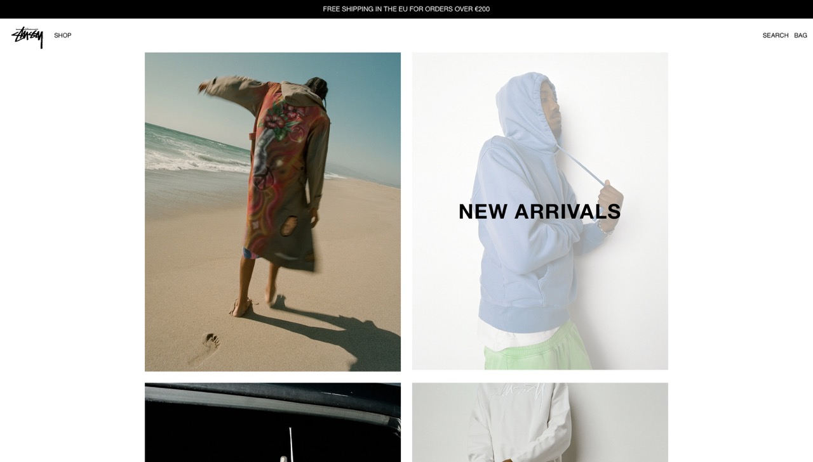
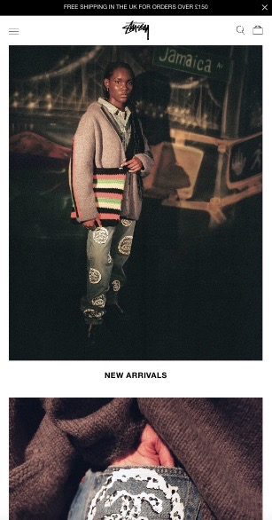
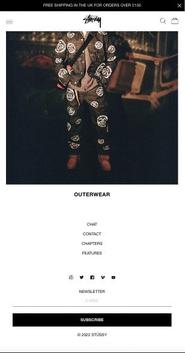
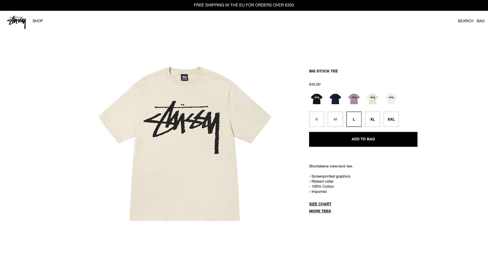
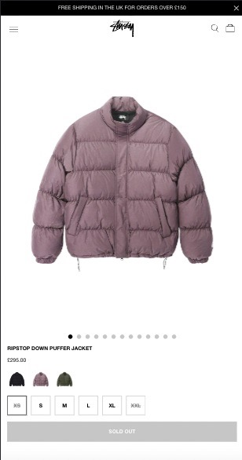
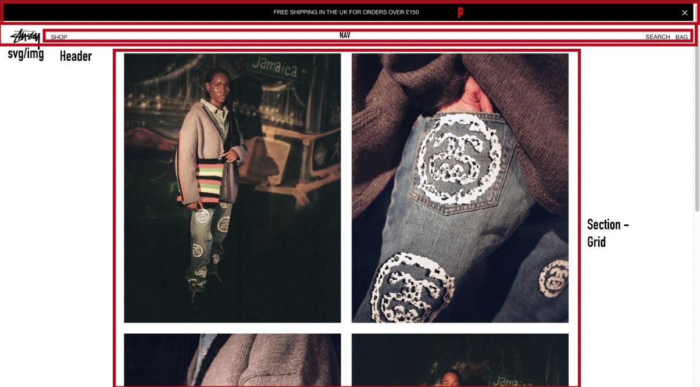
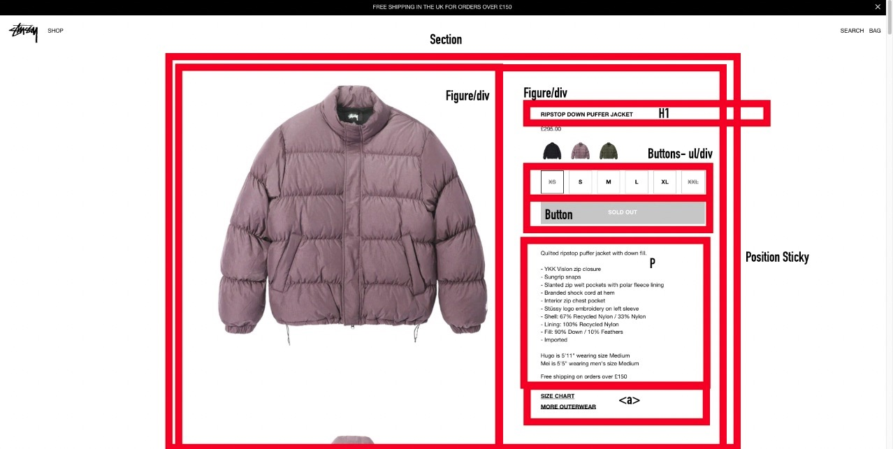
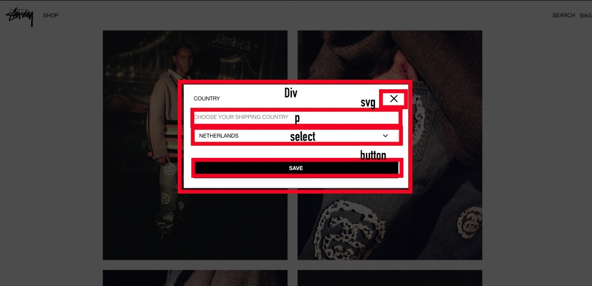

# Procesverslag
Markdown is een simpele manier om HTML te schrijven.  
Markdown cheat cheet: [Hulp bij het schrijven van Markdown](https://github.com/adam-p/markdown-here/wiki/Markdown-Cheatsheet).

Nb. De standaardstructuur en de spartaanse opmaak van de README.md zijn helemaal prima. Het gaat om de inhoud van je procesverslag. Besteedt de tijd voor pracht en praal aan je website.

Nb. Door *open* toe te voegen aan een *details* element kun je deze standaard open zetten. Fijn om dat steeds voor de relevante stuk(ken) te doen.

## Jij

  
uitwerken voor kick-off werkgroep

  ### Auteur:
  Brett Guis

  #### Je startniveau:
  Blauw

  #### Je focus:
  Responsive Plane
 

## Je website

  
uitwerken voor kick-off werkgroep

  ### Je opdracht:
  link naar de website die je gaat namaken óf de naam/omschrijving van je eigen ontwerp
  https://eu.stussy.com
  #### Screenshot(s) van de eerste pagina (small screen): 
  hier de naam van de pagina  
  
   
     

  #### Screenshot(s) van de tweede pagina (small screen):
  hier de naam van de pagina  
  
  
 

## Toegankelijkheidstest 1/2 (week 1)

  
uitwerken na test in 1e werkgroep

  ### Bevindingen
  Lijst met je bevindingen die in de test naar voren kwamen:
  
  1. veel afbeeldingen zijn niet gelabeld en er is voor sommige afbeeldingen niet duidelijk wat voor 
   afbeelding het is zonder naar de afbeelding te kijken

  2. Er zijn niet altijd states gebruikt voor de knoppen

  3. Teksten zijn redelijk klein. (stussy huisstijl dus wellicht andere oplossing voor vinden)

  #### Screenreader
  Hier korte omschrijving (met indien nodig afbeeldingen)

 1. Veel afbeeldingen zijn niet gelabeld en zijn dus niet duidelijk voor de screenreader

 2. Veel knoppen met namen die niet te begrijpen zijn door alleen de naam te horen bijvoorbeeld: 'Chapters'

  Hier een omschrijving van hoe het opgelost kan worden (met indien nodig afbeeldingen)

 1. Afbeeldingen en knoppen dienen goed gelabeld te worden zodat deze wel duidelijk zullen zijn op mijn  eigen 
  site

 2. sommige knoppen zoals 'chapters' kunnen we weglaten omdat deze kunnen zorgen voor ruis bij mensen die de   
  screenreader gebruiken

  #### Muis en Toetsenbord 
  Hier korte omschrijving (met indien nodig afbeeldingen)

 1. de knoppen op de stussy site zijn redelijk klein en dus 
  wellicht lastig om aan te klikken met de muis. 

 2. sommige knoppen zijn disabled bij bijvoorbeeld uitverkochte 
  producten. hhier zou ik evt een melding kunnen maken ipv de knop 
   te disablen omdat dit voor verwarring kan zorgemn

  Hier een omschrijving van hoe het opgelost kan worden (met indien nodig afbeeldingen)

  1. aangezien het huisstijl is van stussy om de tekst klein te   
   houden moet ik hier een andere oplossing voor bedenken. door 
    gebruik te maken van een goede focus sla ik twee vliegen in 
    een klap. mensen die moeilijk hun muis kunnen bedienen 
    kunnen dan gebruik maken van de tab knop en duidelijk zien 
    welk element zij geselecteerd hebben.

  2. ik zorg ervoor dat ik geen knoppen disable op de pagina om   
  verwarring te voorkomen.

  #### Motoriek (shocks, elastiekjes)
  Hier korte omschrijving (met indien nodig afbeeldingen)

  1. zoals hierboven vermeld zijn de knoppen redelijk klein en dus 
   in sommige gevallen lastig aan te klikken. door een goede focus 
    te gebruiken kunnen mensen die geen goede controle hebben 
     over hun muis alsnog simpel door de website heen tabben.

  2. ook mensen met handen die anders werken dan normaal (elastiekjes) kunnen door te tabben de website gebruiken.

  #### Visueel (brillen, contrast, kleurenblind, dark/light). 
  Hier korte omschrijving (met indien nodig afbeeldingen)
 1. doordat mijn site zwart wit is en dus een hoog contrast heeft tussen de elementen vind ik het niet heel interessant om de site te verbeteren op visueel gebied.
    omdat is geblijken uit mijn eerdere onderzoek dat vrijwel elke bijwerking (dus ooik visueel) baat zou hebben bij een goed werkende screenreader met een goede en 
     duidelijke focus ga ik mij hier op focussen. 

## Breakdownschets (week 1)

  
uitwerken na afloop 2e werkgroep

  ### de hele pagina: 
  
  

  ### dynamisch deel (bijv menu): 
  

## Voortgang 1 (week 2)

  
uitwerken voor 1e voortgang

  ### Stand van zaken
  eerste les gemist vanwege fysieke gesteldheid.
  wel bij kunnen blijven met het huiswerk en de intro opdracht.

  goed kunnen oefenen met flexbox

  ### Agenda voor meeting
  samen met je groepje opstellen

  | kars           | naomi.             | tico.        | brett            |
  |html doornemen  | html doornemen     |html doornemen|html doornemen    |
   eerste css                                            hulp met breakdown
   doorlopen             

  ### Verslag van meeting
  hier na afloop snel de uitkomsten van de meeting vastleggen

ik heb vooral veel gehad aan de feedback aan mijn klasgenotem. zelf had ik nog niks op papier of online.
het doornemen van onze html's heeft me wel verder op weg geholpen.

## Voortgang 2 (week 3)

  
uitwerken voor 2e voortgang

  ### Stand van zaken
  header plus footer af (html en gestijld in css)
  vragen hoe ik mijn section het best kan indelen.

  ### Agenda voor meeting
  samen met je groepje opstellen

gezamelijke pinpoints tijdens voortgangsgesprek:

alles even door kijken en vragen wat ons nog te wachten staat.
vragen wat we nog moeten doen voor een voldoende

  ### Verslag van meeting
  hier na afloop snel de uitkomsten van de meeting vastleggen

ik had een aantal vragen die ik goed achteraf zelf op heb kunnen lossen door nog eens de huiswerk opdrachten te maken.
aan de slag met grid huiswerk. en beginnen met productpagina.

## Toegankelijkheidstest 2/2 (week 4)

  
uitwerken na test in 8e werkgroep

  ### Bevindingen
  Lijst met je bevindingen die in de test naar voren kwamen (geef ook aan wat er verbeterd is):

  1. de oplossingen die ik na test 1 heb bedacht zijn nuttig en werken erg goed voor vrijwel elke beperking.

  2. er waren geen tot weinig states toegevoegd aan de site van stussy. Dit heb ik wel gedaan en dit werkt goed en duidelijk.

  3. door de oplossingen die ik heb toegepast heb ik de tekst in de huisstijl van stussy kunnen houden. (klein)

  #### Screenreader
  Hier korte omschrijving (met indien nodig afbeeldingen)

 door alle elementen beter te omschrijven voor de screenreader is het makkelijker te begrijpen wat er staat zonder naar de afbeelding te kijken.
 alle elementen worden gelezen door de screenreader en dit werkt goed (beter dan de originele site)
 
 NOTE: Socials iconen in de footer nog even leesbaar maken voor de voice over.

  #### Muis en Toetsenbord 
  Hier korte omschrijving (met indien nodig afbeeldingen)

  door de focus toe te hebben gepast is het makkelijker om de site te gebruiken dan met de muis wanneer de gebruiker schokken krijgt. 
  ik heb dit uiteraard getest op verschillende toetsenborden. de lastigste om te gebruiken was een macbook. De knoppen van een macbook zijn lastig een voor een in te  
   drukken omdat er weinig kracht nnodig is en de knoppen zijn plat. 

  #### Motoriek (shocks, elastiekjes)
  Hier korte omschrijving (met indien nodig afbeeldingen)

 zoals hierboven en in de eerste toegangkelijkheids test te hebben vermeld is de kleine tekst van de stussy site deel van de huisstijl. Ik moest hier dus een andere 
  oplossing voor vinden voor mensen die moeilijk individuele knoppen konden bereiken met de muis. ik heb een focus toegevoegd en alle afbeeldingen duidelijke 
   omschrijvingen in de html gegeven waardoor ook mensen met een slechter motoriek door de website heen kunnen tabben.

  #### Visueel (brillen, contrast, kleurenblind, dark/light). 
   1. doordat mijn site zwart wit is en dus een hoog contrast heeft tussen de elementen vind ik het niet heel interessant om de site te verbeteren op visueel gebied.
    omdat is geblijken uit mijn eerdere onderzoek dat vrijwel elke bijwerking (dus ooik visueel) baat zou hebben bij een goed werkende screenreader met een goede en 
     duidelijke focus ga ik mij hier op focussen. 

## Voortgang 3 (week 4)

  
uitwerken voor 3e voortgang

  ### Stand van zaken
  ik heb mijn site zo goed als af kunnen krijgen. ik ga naar dit voortgangsgesprek om even te kijken of de studentassistenten nog opmerkingen of verbeterpounten voor 
   mij hebben.

  ### Agenda voor meeting
  samen met je groepje opstellen

tico wilt graag uitleg over mediaquery en zijn site doornemen.

naomi 'heeft nog wat specifieke vragen

kars wilt zijn html en css doorlopen en vragen wat het beste is om de vaart erin te houden.

ik wil graag mijn site doorlopen en vragen of er wat op aan te merken is door de student asstistenten. 

  ### Verslag van meeting
  hier na afloop snel de uitkomsten van de meeting vastleggen

ik had bij sommige elementen een figure gebruikt om de elementen op hun plek te krijgen, dit kon beter. 
ik moest hier gewoon gebruik maken van een div. ik zat hier fout omdat ik dacht dat ik helemaal geen divs mocht gebruiken.

er kwam uit dat ik nog wat beter mijn elementen had kunnen specificeren in de html.

website was nog niet 10000% responsive, dit was wel erg snel verholpen.

## Eindgesprek (week 5)

  
uitwerken voor eindgesprek

  ### Je uitkomst - karakteristiek screenshots:
  

  ### Dit ging goed/Heb ik geleerd: 
  Korte omschrijving met plaatjes

  Ik heb hoewel ik het nog steeds heel lastig vind alle css selectoren juist neergezet. (nadat het 1000x mis is gegaan)

  ik heb flexbox erg goed onder de knie gekregen naar mijn idee.

  ik heb een hoop nieuwe css properties geleerd

  ik heb geleerd goed gebruik te maken van de 'element inspecteren tool'

  ### Dit was lastig/Is niet gelukt:

  ik vind het nog steeds erg lastig om html en css te lezen (aan elkaar te koppelen)
  ik moet echt 3x kijken om te zien wat er nou precies allemaal staat en wat wat doet. Als ik er mee bezig ben gaat het wel, totdat ik ergens een probleem heb staamn 
  en terug moet zoeken in mijn code waar het nou precies mis gaat allemaal.

  ik vind responsiveness nog erg lastig om goed te krijgen. dit is me gelukkig wel gelukt

  ik vind elementen positioneren nog steeds niet te doen.... 
  
  wat ik op heb kunnen leveren wat mijn site betreft ben ik erg trots op. ik had alleen wel meer tijd mogen besteden aan mijn proces verslag d.m.v. bijvoorbeeld 
   plaatsjes en voorbeelden, hier ben ik mij van bewust.§

## Bronnenlijst

  
continu bijhouden terwijl je werkt

  Nb. Wees specifiek ('css-tricks' als bron is bijv. niet specifiek genoeg).

  1. https://docs.emmet.io/cheat-sheet/
  2. https://icons.getbootstrap.com
  3. https://htmlcheatsheet.com/css/
  4. natuurlijk de studentassistenten ;)
  5. https://dlo.mijnhva.nl/d2l/le/content/437099/Home. ik ben vaak teruggekeerd naar de slides van bepaalde lessen.
  6. https://www.w3schools.com/howto/howto_css_sticky_element.asp
  7. https://flexboxfroggy.com/#nl

